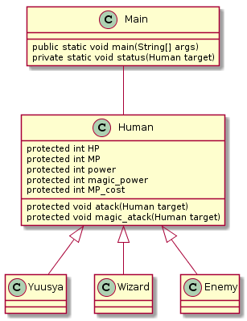

# 最終課題
調べながらでも構わないので、自力で解く努力をしてください。
# RPGっぽいシステム
下記の手順に従い、RPG風なプログラムを作成しなさい。
1. **rpg**というパッケージを作成しなさい
1. 以下のクラス図のように作成しなさい  
    
1. Yuusya,Wizard,Enemyそれぞれのコンストラクタを作成し、任意のステータスを代入しなさい
1. Mainメソッドは以下の通りにしなさい。
    ```java
    public static void main(String[] args) {
        Human human = new Human();
        Yuusya yuusya = new Yuusya();
        Wizard wizard = new Wizard();
        Enemy enemy = new Enemy();

        System.out.println(enemy.name + "が現れた。");

        yuusya.atack(enemy);
        wizard.magic_atack(enemy);
        enemy.atack(wizard);

        status(yuusya);
        status(wizard);
        status(enemy);
    }
    ```
5. 実行結果は以下の通りである。実行結果から必要なコードを考えなさい。
    >ラスボスが現れた。  
    >勇者の攻撃  
    >ラスボスの体力は400になった  
    >魔法使いの魔法攻撃  
    >ラスボスの体力は200になった  
    >ラスボスの攻撃  
    >魔法使いの体力は50になった  
    >勇者のステータス  
    >HP : 200  
    >MP : 50  
    >Power : 100  
    >魔法使いのステータス  
    >HP : 50  
    >MP : 100  
    >Power : 10  
    >ラスボスのステータス  
    >HP : 200  
    >MP : 100  
    >Power : 50  
# 銀行っぽいシステム
1. **bank**というパッケージを作りなさい
1. Slackで送ったurlへアクセスし、課題7-2、課題7-3に取り組みなさい

